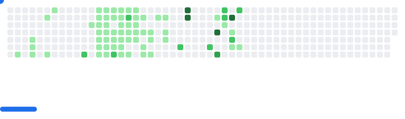

# 💫 About Me:
👋 Hi, I’m @Titanflame26 a.k.a Bharadwaj. 👀 I’m interested coding in python and java. 🌱 I’m currently learning Devops tools. 💞️ I’m looking to collaborate on open source projects involving kubernetes and other deployment practices. 📫 connect to me via mail-1rn22cs104.o.bharadwaj@gmail.com

  

<picture>
  <source
    media="(prefers-color-scheme: dark)"
    srcset="images/breakout-dark.svg"
  />
  <source
    media="(prefers-color-scheme: light)"
    srcset="images/breakout-light.svg"
  />
  
</picture>

# 💻 Tech Stack:
                        
# 📊 GitHub Stats:

 

 

<!-- Proudly created with GPRM ( https://gprm.itsvg.in ) -->

<!---
Titanflame26/Titanflame26 is a ✨ special ✨ repository because its `README.md` (this file) appears on your GitHub profile.
You can click the Preview link to take a look at your changes.
--->
